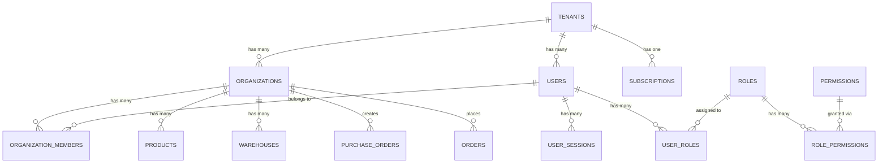
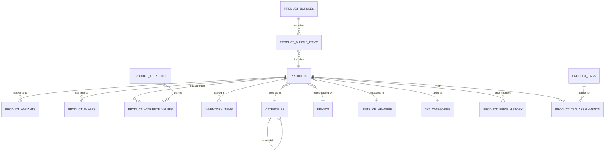
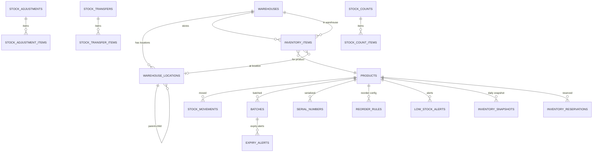
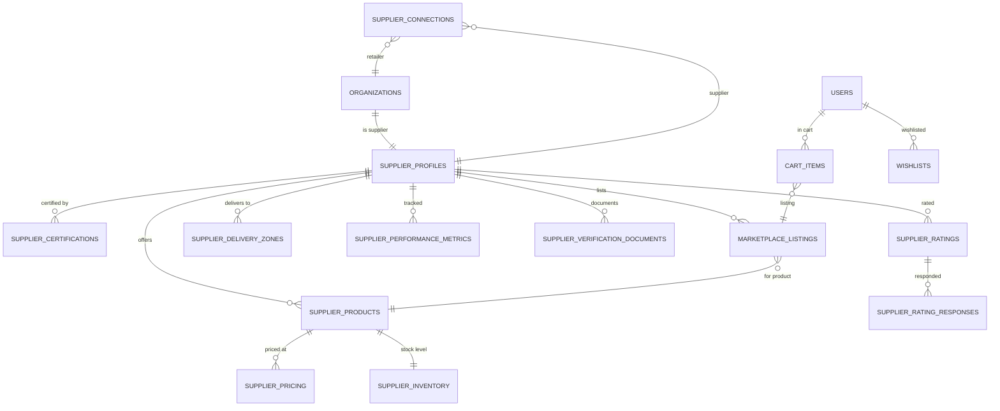
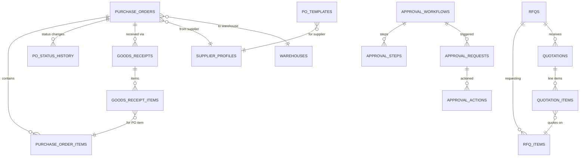
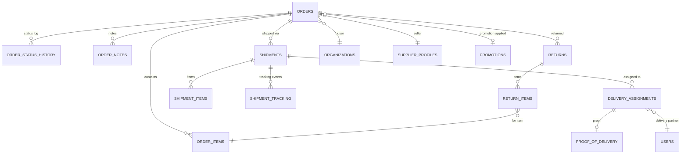
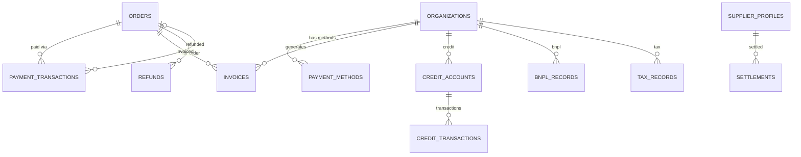
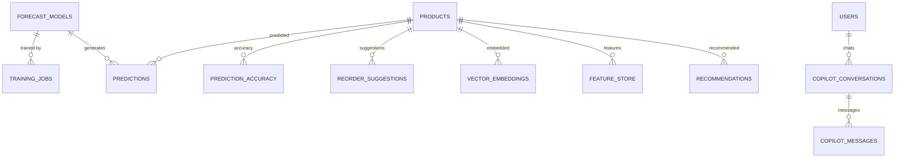

# SmartSupply AI — Entity Relationship Diagrams

### Version: 1.0
### Last Updated: 2026-06-16

---

# 1. Core Domain Relationships

---

# 2. Product Catalog Domain

---

# 3. Inventory Domain

---

# 4. Supplier & Marketplace Domain

---

# 5. Procurement Domain

---

# 6. Orders & Fulfillment Domain

---

# 7. Payments & Finance Domain

---

# 8. AI & Forecasting Domain

---

# 9. Cross-Domain Relationship Summary

| From Domain | To Domain | Relationship |
|------------|-----------|-------------|
| Tenants | All | Every entity belongs to a tenant |
| Users | Auth | Users have sessions, MFA, OAuth |
| Users | RBAC | Users have roles and permissions |
| Organizations | Products | Organizations own products |
| Organizations | Suppliers | Organizations can be suppliers |
| Products | Inventory | Products are tracked in inventory |
| Products | Marketplace | Products are listed on marketplace |
| Suppliers | Procurement | POs are sent to suppliers |
| Suppliers | Orders | Orders fulfilled by suppliers |
| Orders | Payments | Orders are paid via transactions |
| Orders | Shipments | Orders are shipped |
| Orders | Returns | Orders can be returned |
| Products | AI | Products have forecasts |
| All Entities | Audit | All changes are audit logged |
| All Entities | Notifications | Events trigger notifications |

---

# 10. Table Count Summary

| Domain | Table Count |
|--------|:-----------:|
| Tenants & Platform | 5 |
| Authentication & Identity | 12 |
| Organizations | 12 |
| RBAC | 6 |
| Subscriptions & Billing | 10 |
| Product Catalog | 18 |
| Inventory | 20 |
| Suppliers | 12 |
| Marketplace | 12 |
| Procurement | 15 |
| Orders & Fulfillment | 12 |
| Payments & Finance | 10 |
| Notifications | 6 |
| AI & Forecasting | 10 |
| Analytics & Reporting | 8 |
| Documents & Contracts | 6 |
| Audit & Compliance | 5 |
| Admin & Support | 6 |
| **Total** | **201** |
