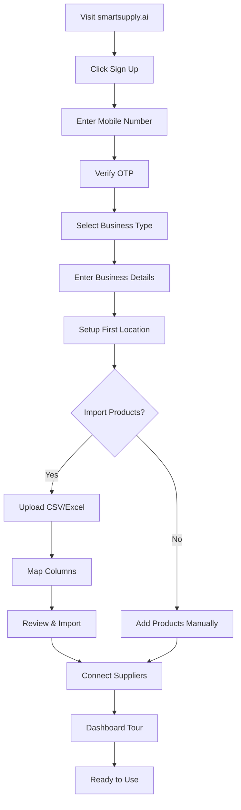
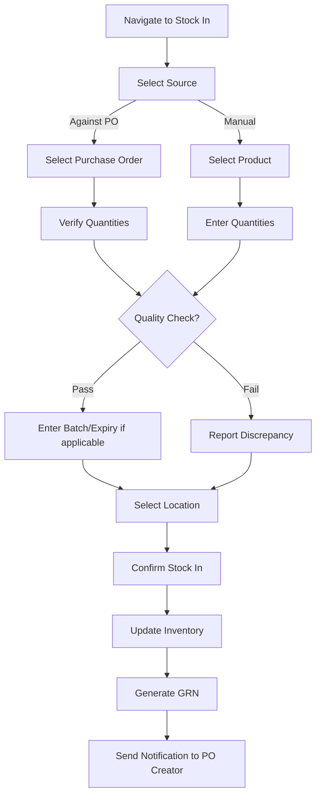
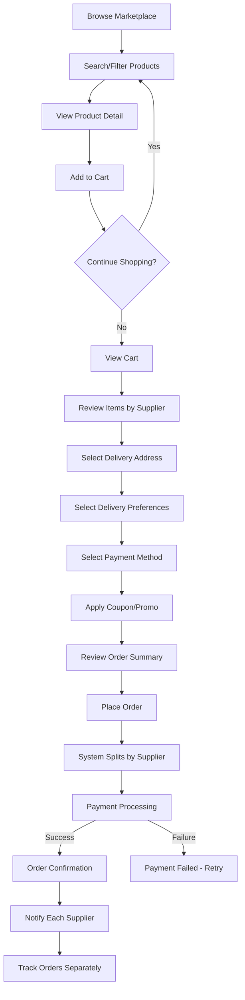
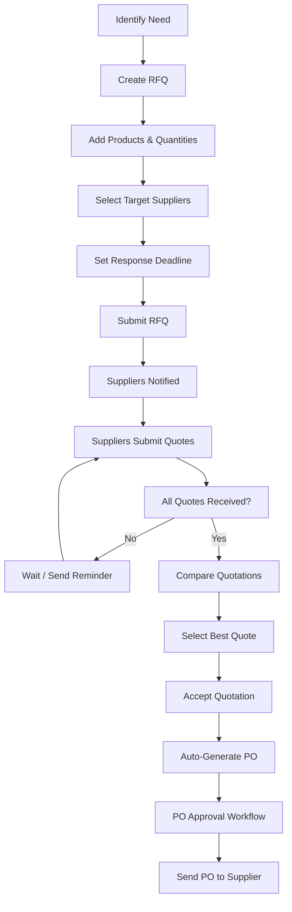
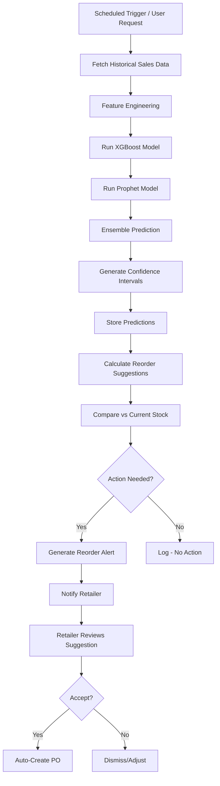

# SmartSupply AI — Information Architecture

### Version: 1.0
### Last Updated: 2026-06-16

---

# 1. Navigation Architecture

## 1.1 Retailer Navigation

```
┌─────────────────────────────────────────────────────────────────────┐
│ SmartSupply AI — Retailer Portal                                    │
├─────────────────────────────────────────────────────────────────────┤
│                                                                     │
│  📊 Dashboard                                                       │
│  │                                                                  │
│  📦 Inventory                                                       │
│  ├── Products                                                       │
│  │   ├── All Products                                               │
│  │   ├── Add Product                                                │
│  │   ├── Import Products                                            │
│  │   ├── Categories                                                 │
│  │   ├── Brands                                                     │
│  │   └── Units of Measure                                          │
│  ├── Stock                                                          │
│  │   ├── Stock Overview                                             │
│  │   ├── Stock In                                                   │
│  │   ├── Stock Out                                                  │
│  │   ├── Stock Adjustments                                          │
│  │   ├── Stock Transfers                                            │
│  │   └── Stock Counts                                               │
│  ├── Batches & Expiry                                               │
│  │   ├── Batch List                                                 │
│  │   ├── Expiring Soon                                              │
│  │   └── Expired Items                                              │
│  └── Warehouses                                                     │
│      ├── All Warehouses                                             │
│      ├── Add Warehouse                                              │
│      └── Locations                                                  │
│                                                                     │
│  🏪 Marketplace                                                     │
│  ├── Browse Products                                                │
│  ├── Search                                                         │
│  ├── Suppliers Directory                                            │
│  ├── Compare Suppliers                                              │
│  ├── My Favorites                                                   │
│  ├── Cart                                                           │
│  └── Order History                                                  │
│                                                                     │
│  📋 Procurement                                                     │
│  ├── Purchase Orders                                                │
│  │   ├── All POs                                                    │
│  │   ├── Create PO                                                  │
│  │   ├── PO Templates                                               │
│  │   └── Pending Approvals                                          │
│  ├── RFQ                                                            │
│  │   ├── All RFQs                                                   │
│  │   ├── Create RFQ                                                 │
│  │   └── Quotation Comparison                                       │
│  └── Goods Receipt                                                  │
│      ├── Pending Receipts                                           │
│      └── Receipt History                                            │
│                                                                     │
│  📊 Analytics                                                       │
│  ├── Sales Dashboard                                                │
│  ├── Inventory Analytics                                            │
│  │   ├── Stock Valuation                                            │
│  │   ├── Turnover Analysis                                          │
│  │   ├── Dead Stock                                                 │
│  │   ├── ABC Analysis                                               │
│  │   └── Stock Aging                                                │
│  ├── Procurement Analytics                                          │
│  │   ├── Spend Analysis                                             │
│  │   ├── Supplier Performance                                       │
│  │   └── Price Trends                                               │
│  ├── Stockout Analytics                                             │
│  └── Reports                                                        │
│      ├── Generate Report                                            │
│      ├── Scheduled Reports                                          │
│      └── Report Archive                                             │
│                                                                     │
│  🤖 AI Assistant                                                    │
│  ├── Chat                                                           │
│  ├── Demand Forecasts                                               │
│  ├── Reorder Suggestions                                            │
│  └── Inventory Optimization                                         │
│                                                                     │
│  💰 Finance                                                         │
│  ├── Invoices                                                       │
│  ├── Payments                                                       │
│  ├── Credit & BNPL                                                  │
│  └── Settlements                                                    │
│                                                                     │
│  🔔 Notifications                                                   │
│  ├── Notification Center                                            │
│  └── Preferences                                                    │
│                                                                     │
│  ⚙️ Settings                                                        │
│  ├── Organization                                                   │
│  │   ├── Profile                                                    │
│  │   ├── Branding                                                   │
│  │   └── Locations                                                  │
│  ├── Users & Roles                                                  │
│  │   ├── Team Members                                               │
│  │   ├── Invite User                                                │
│  │   └── Roles & Permissions                                        │
│  ├── Subscription                                                   │
│  │   ├── Current Plan                                               │
│  │   ├── Upgrade                                                    │
│  │   ├── Usage                                                      │
│  │   └── Billing History                                            │
│  ├── Integrations                                                   │
│  │   ├── API Keys                                                   │
│  │   └── Webhooks                                                   │
│  ├── Notifications                                                  │
│  └── Account                                                        │
│      ├── Profile                                                    │
│      ├── Security (MFA)                                             │
│      └── Sessions                                                   │
└─────────────────────────────────────────────────────────────────────┘
```

## 1.2 Supplier Navigation

```
┌─────────────────────────────────────────────────────────────────────┐
│ SmartSupply AI — Supplier Portal                                    │
├─────────────────────────────────────────────────────────────────────┤
│                                                                     │
│  📊 Dashboard                                                       │
│  │                                                                  │
│  📦 Products                                                        │
│  ├── My Products                                                    │
│  ├── Add Product                                                    │
│  ├── Bulk Upload                                                    │
│  ├── Pricing Management                                             │
│  ├── Categories                                                     │
│  └── Inventory Sync                                                 │
│                                                                     │
│  🏪 Marketplace Listings                                            │
│  ├── Active Listings                                                │
│  ├── Create Listing                                                 │
│  ├── Promotions                                                     │
│  └── Featured Products                                              │
│                                                                     │
│  📋 Orders                                                          │
│  ├── Incoming Orders                                                │
│  ├── Processing                                                     │
│  ├── Shipped                                                        │
│  ├── Completed                                                      │
│  ├── Cancelled/Returns                                              │
│  └── Order Settings                                                 │
│                                                                     │
│  📄 RFQ Responses                                                   │
│  ├── Pending RFQs                                                   │
│  ├── My Quotations                                                  │
│  └── Won/Lost                                                       │
│                                                                     │
│  🚚 Shipments                                                       │
│  ├── Create Shipment                                                │
│  ├── Active Shipments                                               │
│  ├── Delivery Partners                                              │
│  └── Shipping Settings                                              │
│                                                                     │
│  📊 Analytics                                                       │
│  ├── Sales Dashboard                                                │
│  ├── Order Analytics                                                │
│  ├── Customer Analytics                                             │
│  ├── Product Performance                                            │
│  ├── Revenue Reports                                                │
│  └── Reviews & Ratings                                              │
│                                                                     │
│  💰 Finance                                                         │
│  ├── Invoices                                                       │
│  ├── Payments Received                                              │
│  ├── Settlements                                                    │
│  ├── Credit Given                                                   │
│  └── Tax Reports                                                    │
│                                                                     │
│  ⚙️ Settings                                                        │
│  ├── Business Profile                                               │
│  ├── Verification                                                   │
│  ├── Team Members                                                   │
│  ├── Delivery Zones                                                 │
│  ├── Payment Settings                                               │
│  ├── Notification Preferences                                       │
│  └── Subscription                                                   │
└─────────────────────────────────────────────────────────────────────┘
```

## 1.3 Admin Navigation

```
┌─────────────────────────────────────────────────────────────────────┐
│ SmartSupply AI — Admin Panel                                        │
├─────────────────────────────────────────────────────────────────────┤
│                                                                     │
│  📊 Dashboard                                                       │
│  │                                                                  │
│  🏢 Tenant Management                                               │
│  ├── All Tenants                                                    │
│  ├── Tenant Detail                                                  │
│  ├── Create Tenant                                                  │
│  ├── Tenant Usage                                                   │
│  └── Feature Overrides                                              │
│                                                                     │
│  👥 User Management                                                 │
│  ├── All Users                                                      │
│  ├── User Detail                                                    │
│  ├── Suspended Users                                                │
│  └── User Activity                                                  │
│                                                                     │
│  ✅ Supplier Verification                                           │
│  ├── Pending Verification                                           │
│  ├── Verified Suppliers                                             │
│  ├── Rejected                                                       │
│  └── Verification Criteria                                          │
│                                                                     │
│  🛡️ Marketplace Moderation                                          │
│  ├── Flagged Products                                               │
│  ├── Reported Reviews                                               │
│  ├── Reported Suppliers                                             │
│  └── Moderation Rules                                               │
│                                                                     │
│  💳 Billing & Subscriptions                                         │
│  ├── All Subscriptions                                              │
│  ├── Revenue Dashboard                                              │
│  ├── Invoices                                                       │
│  ├── Subscription Plans                                             │
│  └── Promo Codes                                                    │
│                                                                     │
│  🎫 Support Desk                                                    │
│  ├── Open Tickets                                                   │
│  ├── My Assigned                                                    │
│  ├── Resolved                                                       │
│  └── Knowledge Base                                                 │
│                                                                     │
│  🤖 AI Monitoring                                                   │
│  ├── Copilot Usage                                                  │
│  ├── Forecast Accuracy                                              │
│  ├── Model Performance                                              │
│  └── Training Jobs                                                  │
│                                                                     │
│  📋 Audit Logs                                                      │
│  ├── Activity Log                                                   │
│  ├── Security Events                                                │
│  ├── Data Changes                                                   │
│  └── Compliance Reports                                             │
│                                                                     │
│  📊 Platform Analytics                                              │
│  ├── GMV Dashboard                                                  │
│  ├── User Growth                                                    │
│  ├── Transaction Volume                                             │
│  ├── Engagement Metrics                                             │
│  └── Platform Health                                                │
│                                                                     │
│  ⚙️ Platform Settings                                               │
│  ├── General                                                        │
│  ├── Feature Flags                                                  │
│  ├── Email Templates                                                │
│  ├── Notification Templates                                         │
│  ├── Tax Configuration                                              │
│  ├── API Gateway                                                    │
│  └── System Health                                                  │
└─────────────────────────────────────────────────────────────────────┘
```

---

# 2. Complete Screen Inventory (200+ Screens)

## 2.1 Authentication & Onboarding (15 Screens)

| # | Screen | Route | Description |
|:-:|--------|-------|-------------|
| 1 | Login | `/login` | Email/password + OTP + Google OAuth login |
| 2 | Register | `/register` | New account registration |
| 3 | Register — Business Type | `/register/type` | Select Retailer/Supplier/Distributor |
| 4 | Register — Business Details | `/register/details` | Business name, GST, address |
| 5 | Email Verification | `/verify-email` | Email verification OTP entry |
| 6 | Phone Verification | `/verify-phone` | Phone OTP verification |
| 7 | Forgot Password | `/forgot-password` | Password reset request |
| 8 | Reset Password | `/reset-password` | New password entry |
| 9 | MFA Setup | `/mfa/setup` | Enable 2FA (TOTP/SMS) |
| 10 | MFA Verify | `/mfa/verify` | MFA code entry on login |
| 11 | Onboarding — Welcome | `/onboarding/welcome` | Welcome screen with guided tour |
| 12 | Onboarding — Store Setup | `/onboarding/store` | Store name, location, type |
| 13 | Onboarding — Import Products | `/onboarding/import` | CSV/Excel product import |
| 14 | Onboarding — Connect Suppliers | `/onboarding/suppliers` | Discover and connect suppliers |
| 15 | Onboarding — Complete | `/onboarding/complete` | Setup summary, go to dashboard |

## 2.2 Retailer Dashboard (8 Screens)

| # | Screen | Route | Description |
|:-:|--------|-------|-------------|
| 16 | Main Dashboard | `/dashboard` | KPI cards, charts, alerts, recent activity |
| 17 | Quick Actions | `/dashboard` (modal) | Quick stock in, create PO, search |
| 18 | Low Stock Widget | `/dashboard` (widget) | Products below reorder level |
| 19 | Expiring Soon Widget | `/dashboard` (widget) | Products expiring within threshold |
| 20 | Recent Orders Widget | `/dashboard` (widget) | Last 10 orders with status |
| 21 | Sales Trend Widget | `/dashboard` (widget) | Revenue line chart (30 days) |
| 22 | Top Products Widget | `/dashboard` (widget) | Top 10 selling products |
| 23 | AI Insights Widget | `/dashboard` (widget) | AI-generated actionable insights |

## 2.3 Product Management (18 Screens)

| # | Screen | Route | Description |
|:-:|--------|-------|-------------|
| 24 | Product List | `/products` | Paginated table with search, filters, bulk actions |
| 25 | Product Detail | `/products/[id]` | Full product info, stock, history, images |
| 26 | Create Product | `/products/new` | Product creation form |
| 27 | Edit Product | `/products/[id]/edit` | Product edit form |
| 28 | Product Variants | `/products/[id]/variants` | Variant matrix (size × color) |
| 29 | Product Images | `/products/[id]/images` | Image upload, reorder, delete |
| 30 | Product History | `/products/[id]/history` | Stock movement history for product |
| 31 | Category List | `/products/categories` | Category tree view |
| 32 | Create Category | `/products/categories/new` | Category creation |
| 33 | Edit Category | `/products/categories/[id]` | Category editing |
| 34 | Brand List | `/products/brands` | Brands table with CRUD |
| 35 | Create Brand | `/products/brands/new` | Brand creation |
| 36 | Import Products | `/products/import` | CSV/Excel upload, mapping, preview |
| 37 | Import Progress | `/products/import/progress` | Import progress with error log |
| 38 | Export Products | `/products/export` | Export configuration and download |
| 39 | Barcode Generator | `/products/barcodes` | Bulk barcode/QR generation and print |
| 40 | Barcode Scanner | `/products/scan` | Camera-based barcode scanning |
| 41 | Units of Measure | `/products/units` | UOM management |

## 2.4 Stock Management (16 Screens)

| # | Screen | Route | Description |
|:-:|--------|-------|-------------|
| 42 | Stock Overview | `/inventory` | All products with current stock levels |
| 43 | Stock Detail | `/inventory/[product_id]` | Per-product stock across all locations |
| 44 | Stock In | `/inventory/stock-in` | Record incoming stock (purchase receipt) |
| 45 | Stock In — Batch Entry | `/inventory/stock-in` (tab) | Batch entry mode for multiple products |
| 46 | Stock Out | `/inventory/stock-out` | Record outgoing stock (sales, damage) |
| 47 | Stock Adjustment | `/inventory/adjustments/new` | Create stock adjustment with reason |
| 48 | Adjustment List | `/inventory/adjustments` | List of all adjustments |
| 49 | Stock Transfer | `/inventory/transfers/new` | Create inter-location transfer |
| 50 | Transfer List | `/inventory/transfers` | List of all transfers |
| 51 | Stock Count — Setup | `/inventory/counts/new` | Initialize stock count (full/partial) |
| 52 | Stock Count — Entry | `/inventory/counts/[id]` | Enter physical counts |
| 53 | Stock Count — Reconciliation | `/inventory/counts/[id]/reconcile` | Compare physical vs system stock |
| 54 | Stock Movement Log | `/inventory/movements` | Full movement history with filters |
| 55 | Low Stock Report | `/inventory/low-stock` | All products below reorder level |
| 56 | Dead Stock Report | `/inventory/dead-stock` | Products with no movement in 90+ days |
| 57 | Stock Valuation | `/inventory/valuation` | Stock value by product, category, location |

## 2.5 Batch & Expiry (6 Screens)

| # | Screen | Route | Description |
|:-:|--------|-------|-------------|
| 58 | Batch List | `/inventory/batches` | All batches with filter/search |
| 59 | Batch Detail | `/inventory/batches/[id]` | Batch info, stock, movements |
| 60 | Expiring Soon | `/inventory/expiring` | Products expiring within configurable window |
| 61 | Expired Items | `/inventory/expired` | Expired products requiring action |
| 62 | Expiry Dashboard | `/inventory/expiry-dashboard` | Expiry analytics and trends |
| 63 | Near-Expiry Actions | `/inventory/expiring/[id]` | Actions: discount, return to supplier, write-off |

## 2.6 Warehouse Management (8 Screens)

| # | Screen | Route | Description |
|:-:|--------|-------|-------------|
| 64 | Warehouse List | `/warehouses` | All warehouses/store locations |
| 65 | Warehouse Detail | `/warehouses/[id]` | Warehouse info, stock summary |
| 66 | Create Warehouse | `/warehouses/new` | Add new warehouse/location |
| 67 | Edit Warehouse | `/warehouses/[id]/edit` | Edit warehouse details |
| 68 | Location Map | `/warehouses/[id]/locations` | Zone → Aisle → Shelf → Bin hierarchy |
| 69 | Create Location | `/warehouses/[id]/locations/new` | Add storage location |
| 70 | Location Stock | `/warehouses/[id]/locations/[loc_id]` | Stock in specific bin/shelf |
| 71 | Multi-Location Overview | `/warehouses/overview` | Cross-warehouse stock comparison |

## 2.7 Supplier Marketplace (20 Screens)

| # | Screen | Route | Description |
|:-:|--------|-------|-------------|
| 72 | Marketplace Home | `/marketplace` | Featured products, categories, promotions |
| 73 | Product Browse | `/marketplace/products` | Product grid with filters and sorting |
| 74 | Product Detail | `/marketplace/products/[id]` | Full product page with supplier info |
| 75 | Product Compare | `/marketplace/compare` | Side-by-side product comparison |
| 76 | Supplier Directory | `/marketplace/suppliers` | Supplier list with filters |
| 77 | Supplier Profile | `/marketplace/suppliers/[id]` | Supplier details, products, ratings |
| 78 | Supplier Compare | `/marketplace/suppliers/compare` | Side-by-side supplier comparison |
| 79 | Search Results | `/marketplace/search` | Search results with faceted filters |
| 80 | Category Page | `/marketplace/categories/[slug]` | Category-specific product listing |
| 81 | Shopping Cart | `/marketplace/cart` | Cart with multi-vendor items |
| 82 | Checkout | `/marketplace/checkout` | Order review, shipping, payment |
| 83 | Checkout — Address | `/marketplace/checkout/address` | Select/add delivery address |
| 84 | Checkout — Payment | `/marketplace/checkout/payment` | Payment method selection |
| 85 | Order Confirmation | `/marketplace/order/confirmation` | Order success with details |
| 86 | My Orders | `/marketplace/orders` | Order history list |
| 87 | Order Detail | `/marketplace/orders/[id]` | Order details with tracking |
| 88 | Order Tracking | `/marketplace/orders/[id]/tracking` | Real-time shipment tracking |
| 89 | Wishlist | `/marketplace/wishlist` | Saved products |
| 90 | Write Review | `/marketplace/orders/[id]/review` | Post-delivery review form |
| 91 | My Favorites | `/marketplace/favorites` | Favorite suppliers list |

## 2.8 Procurement (18 Screens)

| # | Screen | Route | Description |
|:-:|--------|-------|-------------|
| 92 | PO List | `/procurement/purchase-orders` | All POs with status filter |
| 93 | PO Detail | `/procurement/purchase-orders/[id]` | PO full details, items, status |
| 94 | Create PO | `/procurement/purchase-orders/new` | PO creation wizard |
| 95 | Create PO — Supplier | `/procurement/purchase-orders/new` (step) | Select supplier |
| 96 | Create PO — Products | `/procurement/purchase-orders/new` (step) | Add products and quantities |
| 97 | Create PO — Review | `/procurement/purchase-orders/new` (step) | Review and submit |
| 98 | PO Approval | `/procurement/purchase-orders/[id]/approve` | Approve/reject PO |
| 99 | PO Templates | `/procurement/templates` | Saved PO templates |
| 100 | Pending Approvals | `/procurement/approvals` | POs awaiting user's approval |
| 101 | RFQ List | `/procurement/rfqs` | All RFQs list |
| 102 | Create RFQ | `/procurement/rfqs/new` | RFQ creation form |
| 103 | RFQ Detail | `/procurement/rfqs/[id]` | RFQ details with received quotations |
| 104 | Quotation Compare | `/procurement/rfqs/[id]/compare` | Compare received quotations |
| 105 | Quotation Detail | `/procurement/quotations/[id]` | Individual quotation details |
| 106 | Goods Receipt List | `/procurement/goods-receipts` | Pending and completed receipts |
| 107 | Create Goods Receipt | `/procurement/goods-receipts/new` | Receive goods against PO |
| 108 | GRN Detail | `/procurement/goods-receipts/[id]` | Goods Receipt Note details |
| 109 | Approval Workflow Config | `/procurement/workflows` | Configure approval rules |

## 2.9 Analytics & Reports (18 Screens)

| # | Screen | Route | Description |
|:-:|--------|-------|-------------|
| 110 | Sales Dashboard | `/analytics/sales` | Revenue charts, top products, trends |
| 111 | Sales by Product | `/analytics/sales/products` | Product-level sales breakdown |
| 112 | Sales by Category | `/analytics/sales/categories` | Category-level sales breakdown |
| 113 | Sales by Period | `/analytics/sales/period` | Time-based sales comparison |
| 114 | Inventory Dashboard | `/analytics/inventory` | Stock health overview |
| 115 | Inventory Turnover | `/analytics/inventory/turnover` | Turnover ratio analysis |
| 116 | Dead Stock Analysis | `/analytics/inventory/dead-stock` | Non-moving stock details |
| 117 | ABC Analysis | `/analytics/inventory/abc` | Pareto product classification |
| 118 | Stock Aging | `/analytics/inventory/aging` | Stock age distribution |
| 119 | Procurement Dashboard | `/analytics/procurement` | Spend overview |
| 120 | Spend by Supplier | `/analytics/procurement/suppliers` | Supplier-wise spend |
| 121 | Spend by Category | `/analytics/procurement/categories` | Category-wise spend |
| 122 | Supplier Performance | `/analytics/procurement/performance` | Supplier scorecards |
| 123 | Price Trends | `/analytics/procurement/prices` | Historical price analysis |
| 124 | Stockout Analysis | `/analytics/stockouts` | Stockout frequency, impact |
| 125 | Report Generator | `/analytics/reports/new` | Custom report builder |
| 126 | Report Archive | `/analytics/reports` | Generated reports list |
| 127 | Scheduled Reports | `/analytics/reports/scheduled` | Recurring report configs |

## 2.10 AI Assistant (8 Screens)

| # | Screen | Route | Description |
|:-:|--------|-------|-------------|
| 128 | AI Chat | `/ai/chat` | Conversational AI interface |
| 129 | Chat History | `/ai/chat/history` | Past conversations |
| 130 | Demand Forecast | `/ai/forecasting` | Product demand predictions |
| 131 | Forecast Detail | `/ai/forecasting/[product_id]` | Per-product forecast charts |
| 132 | Reorder Suggestions | `/ai/reorder` | AI-recommended reorders |
| 133 | Inventory Optimization | `/ai/optimization` | Overstock/stockout predictions |
| 134 | Supplier Recommendations | `/ai/suppliers` | AI-ranked suppliers per product |
| 135 | AI Insights | `/ai/insights` | Auto-generated business insights |

## 2.11 Finance (14 Screens)

| # | Screen | Route | Description |
|:-:|--------|-------|-------------|
| 136 | Invoice List | `/finance/invoices` | All invoices |
| 137 | Invoice Detail | `/finance/invoices/[id]` | Invoice details |
| 138 | Create Invoice | `/finance/invoices/new` | Manual invoice creation |
| 139 | Invoice Preview | `/finance/invoices/[id]/preview` | Print/PDF preview |
| 140 | Payment List | `/finance/payments` | Payment history |
| 141 | Payment Detail | `/finance/payments/[id]` | Payment details |
| 142 | Make Payment | `/finance/payments/new` | Initiate payment |
| 143 | Credit Dashboard | `/finance/credit` | Credit balances and utilization |
| 144 | Credit History | `/finance/credit/history` | Credit transaction log |
| 145 | BNPL Applications | `/finance/bnpl` | BNPL status and management |
| 146 | Settlement List | `/finance/settlements` | Settlement records |
| 147 | Settlement Detail | `/finance/settlements/[id]` | Settlement breakdown |
| 148 | Tax Summary | `/finance/tax` | GST summary and reports |
| 149 | Financial Reports | `/finance/reports` | P&L, cash flow summaries |

## 2.12 Notifications (4 Screens)

| # | Screen | Route | Description |
|:-:|--------|-------|-------------|
| 150 | Notification Center | `/notifications` | All notifications with tabs |
| 151 | Notification Detail | `/notifications/[id]` | Notification detail (deep link) |
| 152 | Notification Preferences | `/notifications/preferences` | Channel and type preferences |
| 153 | Notification History | `/notifications/history` | Full notification log |

## 2.13 Settings (20 Screens)

| # | Screen | Route | Description |
|:-:|--------|-------|-------------|
| 154 | Organization Profile | `/settings/organization` | Business name, address, logo |
| 155 | Organization Branding | `/settings/branding` | Custom colors, logo, theme |
| 156 | Organization Locations | `/settings/locations` | Manage business locations |
| 157 | Team Members | `/settings/team` | User list with roles |
| 158 | Invite User | `/settings/team/invite` | Send team invitation |
| 159 | User Detail (Admin) | `/settings/team/[id]` | User detail and role management |
| 160 | Roles & Permissions | `/settings/roles` | Custom role definitions |
| 161 | Create Role | `/settings/roles/new` | Custom role creation |
| 162 | Current Plan | `/settings/subscription` | Subscription details |
| 163 | Upgrade Plan | `/settings/subscription/upgrade` | Plan comparison and upgrade |
| 164 | Usage Dashboard | `/settings/subscription/usage` | Feature usage meters |
| 165 | Billing History | `/settings/billing` | Past invoices and payments |
| 166 | Payment Methods | `/settings/billing/methods` | Saved payment methods |
| 167 | API Keys | `/settings/api-keys` | API key management |
| 168 | Webhooks | `/settings/webhooks` | Webhook configuration |
| 169 | Integrations | `/settings/integrations` | Third-party integrations |
| 170 | Notification Settings | `/settings/notifications` | Global notification preferences |
| 171 | My Profile | `/settings/profile` | Personal profile editing |
| 172 | Security Settings | `/settings/security` | Password, MFA, sessions |
| 173 | Active Sessions | `/settings/security/sessions` | Manage active sessions |

## 2.14 Supplier Portal (22 Screens)

| # | Screen | Route | Description |
|:-:|--------|-------|-------------|
| 174 | Supplier Dashboard | `/supplier/dashboard` | KPIs, orders, revenue |
| 175 | My Products | `/supplier/products` | Product list |
| 176 | Add Product | `/supplier/products/new` | Product creation |
| 177 | Edit Product | `/supplier/products/[id]/edit` | Product editing |
| 178 | Bulk Upload | `/supplier/products/upload` | Bulk CSV/Excel product upload |
| 179 | Pricing Management | `/supplier/pricing` | Product pricing rules |
| 180 | Inventory Sync | `/supplier/inventory` | Stock level management |
| 181 | Active Listings | `/supplier/listings` | Marketplace listings |
| 182 | Create Listing | `/supplier/listings/new` | New marketplace listing |
| 183 | Incoming Orders | `/supplier/orders` | New orders to process |
| 184 | Order Detail | `/supplier/orders/[id]` | Order details and actions |
| 185 | Order Processing | `/supplier/orders/[id]/process` | Confirm, pack, ship |
| 186 | Pending RFQs | `/supplier/rfqs` | RFQs to respond to |
| 187 | Submit Quotation | `/supplier/rfqs/[id]/quote` | Quotation form |
| 188 | Create Shipment | `/supplier/shipments/new` | Ship order |
| 189 | Active Shipments | `/supplier/shipments` | Shipment tracking |
| 190 | Sales Analytics | `/supplier/analytics/sales` | Revenue and trends |
| 191 | Customer Analytics | `/supplier/analytics/customers` | Customer distribution |
| 192 | Product Performance | `/supplier/analytics/products` | Per-product metrics |
| 193 | Reviews & Ratings | `/supplier/reviews` | Customer feedback |
| 194 | Business Profile | `/supplier/settings/profile` | Supplier profile editing |
| 195 | Verification | `/supplier/settings/verification` | Document upload for verification |

## 2.15 Admin Panel (30 Screens)

| # | Screen | Route | Description |
|:-:|--------|-------|-------------|
| 196 | Admin Dashboard | `/admin/dashboard` | Platform KPIs and health |
| 197 | Tenant List | `/admin/tenants` | All tenants |
| 198 | Tenant Detail | `/admin/tenants/[id]` | Tenant details and management |
| 199 | Create Tenant | `/admin/tenants/new` | Manual tenant creation |
| 200 | Tenant Usage | `/admin/tenants/[id]/usage` | Tenant resource usage |
| 201 | Feature Overrides | `/admin/tenants/[id]/features` | Toggle features per tenant |
| 202 | All Users | `/admin/users` | Platform-wide user list |
| 203 | User Detail (Admin) | `/admin/users/[id]` | User management |
| 204 | Suspended Users | `/admin/users/suspended` | Suspended accounts |
| 205 | Pending Verification | `/admin/verification/pending` | Suppliers awaiting verification |
| 206 | Verify Supplier | `/admin/verification/[id]` | Verification review |
| 207 | Verified Suppliers | `/admin/verification/verified` | Approved suppliers |
| 208 | Flagged Products | `/admin/moderation/products` | Products reported/flagged |
| 209 | Reported Reviews | `/admin/moderation/reviews` | Reviews under review |
| 210 | Moderation Actions | `/admin/moderation/[id]` | Take moderation action |
| 211 | All Subscriptions | `/admin/subscriptions` | Active subscriptions |
| 212 | Revenue Dashboard | `/admin/revenue` | Revenue analytics |
| 213 | Platform Invoices | `/admin/invoices` | All billing invoices |
| 214 | Subscription Plans | `/admin/plans` | Manage subscription plans |
| 215 | Promo Codes | `/admin/promos` | Promotional codes |
| 216 | Support Tickets | `/admin/support` | All support tickets |
| 217 | Ticket Detail | `/admin/support/[id]` | Ticket conversation |
| 218 | Knowledge Base | `/admin/knowledge-base` | Help articles management |
| 219 | AI Usage Monitor | `/admin/ai/usage` | Copilot usage stats |
| 220 | Forecast Accuracy | `/admin/ai/accuracy` | Model performance |
| 221 | Training Jobs | `/admin/ai/training` | ML training job status |
| 222 | Activity Log | `/admin/audit/activity` | Platform-wide activity |
| 223 | Security Events | `/admin/audit/security` | Security event log |
| 224 | Compliance Reports | `/admin/audit/compliance` | Compliance report generation |
| 225 | Platform Settings | `/admin/settings` | Global platform configuration |

## 2.16 Delivery Partner Screens (6 Screens)

| # | Screen | Route | Description |
|:-:|--------|-------|-------------|
| 226 | Delivery Dashboard | `/delivery/dashboard` | Assigned deliveries, stats |
| 227 | My Deliveries | `/delivery/assignments` | Active delivery list |
| 228 | Delivery Detail | `/delivery/assignments/[id]` | Delivery details, navigation |
| 229 | Proof of Delivery | `/delivery/assignments/[id]/pod` | Photo, signature capture |
| 230 | Delivery History | `/delivery/history` | Completed deliveries |
| 231 | My Profile | `/delivery/profile` | Partner profile and documents |

## 2.17 Error & Utility Screens (7 Screens)

| # | Screen | Route | Description |
|:-:|--------|-------|-------------|
| 232 | 404 Not Found | `/404` | Page not found |
| 233 | 403 Forbidden | `/403` | Access denied |
| 234 | 500 Server Error | `/500` | Server error |
| 235 | Maintenance Mode | `/maintenance` | Platform under maintenance |
| 236 | Feature Locked | `/upgrade-required` | Feature behind paywall |
| 237 | Help & Support | `/help` | Help center and contact |
| 238 | Terms of Service | `/terms` | Legal terms |

**Total: 238 Screens**

---

# 3. User Flows

## 3.1 Retailer First-Time Onboarding



## 3.2 Inventory Stock-In Flow



## 3.3 Marketplace Purchase Flow



## 3.4 Procurement RFQ Flow



## 3.5 AI Demand Forecast Flow



---

# 4. Component Library Specification

## 4.1 Core UI Components

| Component | Variants | Description |
|-----------|---------|-------------|
| Button | primary, secondary, outline, ghost, destructive, icon | Action buttons |
| Input | text, number, email, password, search, textarea | Form inputs |
| Select | single, multi, async-search | Dropdown selects |
| Checkbox | default, indeterminate | Boolean inputs |
| Radio | default, card | Single selection |
| Switch | default, labeled | Toggle inputs |
| Badge | default, success, warning, error, info | Status indicators |
| Avatar | image, initials, icon | User/entity avatars |
| Card | default, interactive, stat | Content containers |
| Dialog | default, alert, confirm, form | Modal dialogs |
| Sheet | left, right, top, bottom | Side panels |
| Tabs | default, pills, underline | Tab navigation |
| Table | default, sortable, selectable | Data tables |
| DataGrid | full-featured | Advanced data grids |
| Toast | success, error, warning, info | Notification toasts |
| Tooltip | default, rich | Hover tooltips |
| Popover | default, menu | Click popovers |
| Command | palette | Command palette (Ctrl+K) |
| Breadcrumb | default | Navigation breadcrumbs |
| Pagination | default, simple | Page navigation |
| Skeleton | text, image, card, table | Loading skeletons |
| Progress | bar, circle, steps | Progress indicators |
| Separator | horizontal, vertical | Visual separators |

## 4.2 Business Components

| Component | Description |
|-----------|-------------|
| StockLevelIndicator | Visual stock level with color coding |
| ExpiryBadge | Days-to-expiry with color coding |
| SupplierCard | Supplier profile card with rating |
| ProductCard | Product card with image, price, stock |
| OrderStatusTimeline | Order lifecycle timeline |
| ApprovalBadge | Approval status indicator |
| KPICard | Metric card with trend arrow |
| ChartWidget | Configurable chart container |
| NotificationItem | Notification list item |
| SearchBar | Global search with suggestions |
| ComparisonTable | Side-by-side comparison layout |
| FileUploader | Drag-and-drop file upload |
| BarcodeScanner | Camera-based barcode reader |
| AIChatBubble | Chat message bubble |
| EmptyState | Empty state illustration + CTA |
| OnboardingStep | Onboarding wizard step |
| PricingCard | Subscription plan card |
| InvoicePreview | Invoice PDF preview |

---

# 5. Responsive Breakpoints

| Breakpoint | Width | Target |
|-----------|-------|--------|
| xs | 0-639px | Mobile phones |
| sm | 640-767px | Large phones |
| md | 768-1023px | Tablets |
| lg | 1024-1279px | Laptops |
| xl | 1280-1535px | Desktops |
| 2xl | 1536px+ | Large monitors |

## Layout Strategy
- **Mobile (xs-sm)**: Single column, bottom navigation, collapsible sections
- **Tablet (md)**: Two-column, sidebar overlay
- **Desktop (lg+)**: Multi-column, persistent sidebar, expanded widgets
