# SmartSupply AI — Marketplace & Procurement Workflows

### Version: 1.0
### Last Updated: 2026-06-16

---

# PART A: MARKETPLACE WORKFLOWS

---

## 1. Supplier Onboarding Flow

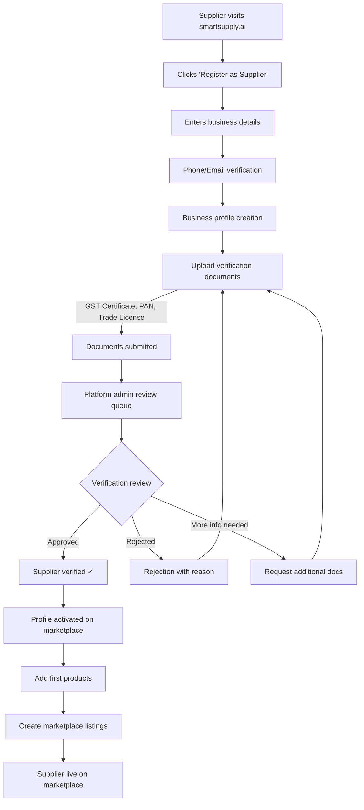

### Verification Checklist
| Document | Required | Auto-Verify |
|----------|:--------:|:-----------:|
| GST Certificate | ✓ | GST API lookup |
| PAN Card | ✓ | — |
| Trade License | Industry-specific | — |
| FSSAI License | Food products only | — |
| Drug License | Pharmaceuticals only | — |
| Bank Account | ✓ (for settlements) | Penny drop |
| Business Address Proof | ✓ | — |

---

## 2. Product Listing Flow

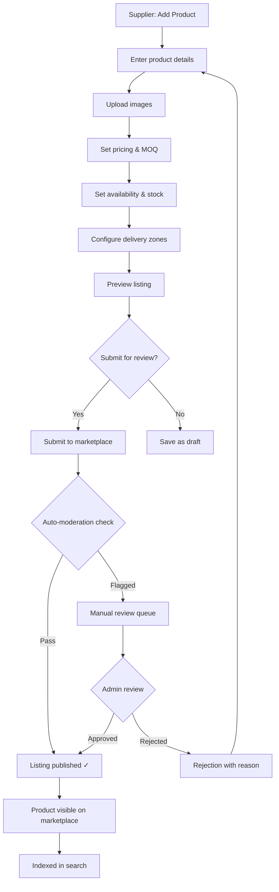

### Auto-Moderation Rules
| Rule | Check | Action |
|------|-------|--------|
| Prohibited keywords | Text scan | Block + flag |
| Image quality | Min 500x500px | Reject |
| Pricing anomaly | Price < 10% of category avg | Flag for review |
| Duplicate listing | Title + category similarity | Flag for review |
| Missing required fields | Validation rules | Block |
| Prohibited categories | Category blocklist | Block |

---

## 3. Search & Discovery Flow

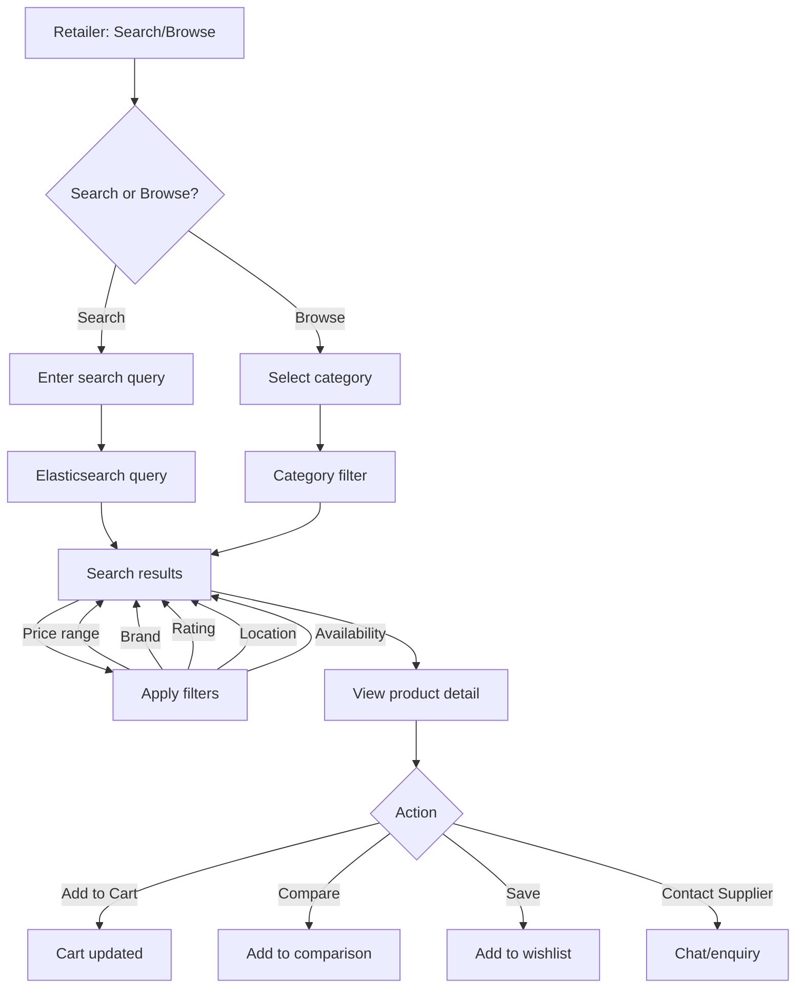

### Search Ranking Factors
| Factor | Weight | Description |
|--------|:------:|-------------|
| Text relevance | 30% | TF-IDF score from Elasticsearch |
| Availability | 20% | In-stock products ranked higher |
| Supplier rating | 15% | Higher rated suppliers preferred |
| Price competitiveness | 15% | Close to category average |
| Recency | 10% | Newer listings get boost |
| Sponsored | 10% | Paid promoted listings |

---

## 4. Cart & Checkout Flow

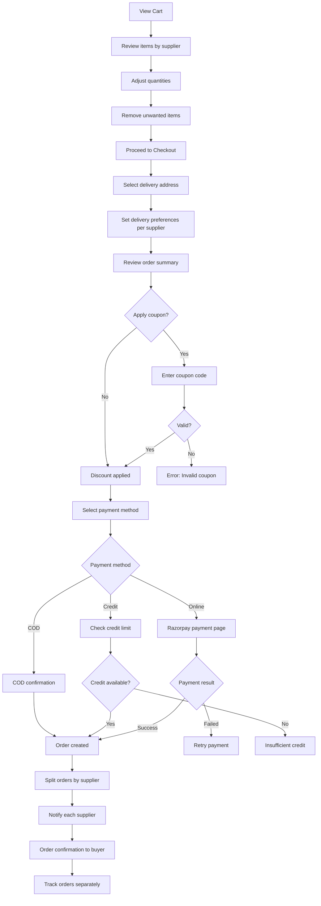

### Multi-Vendor Order Splitting
```python
def split_cart_to_orders(cart_items: list, buyer: Organization) -> list[Order]:
    """Split cart items into per-supplier orders."""
    supplier_groups = group_by(cart_items, key=lambda item: item.supplier_id)

    orders = []
    for supplier_id, items in supplier_groups.items():
        order = Order(
            order_number=generate_order_number(),
            buyer_org_id=buyer.id,
            supplier_id=supplier_id,
            items=items,
            subtotal=sum(item.quantity * item.unit_price for item in items),
            tax_amount=calculate_tax(items),
            shipping_amount=calculate_shipping(supplier_id, items, buyer.address),
        )
        order.total_amount = order.subtotal + order.tax_amount + order.shipping_amount
        orders.append(order)

    return orders
```

---

## 5. Order Fulfillment Flow

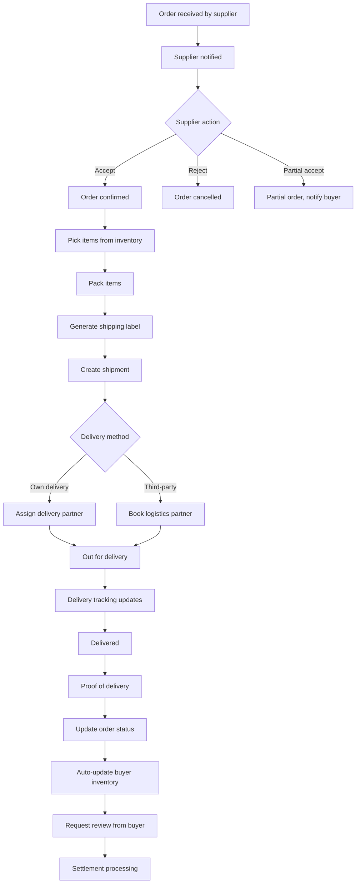

---

## 6. Review & Rating Flow

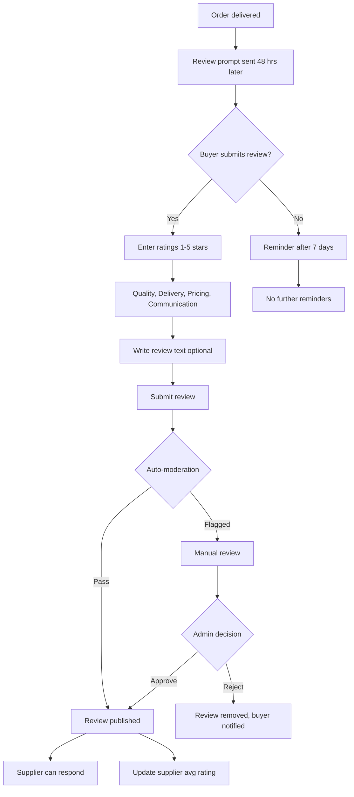

---

## 7. Dispute Resolution Flow

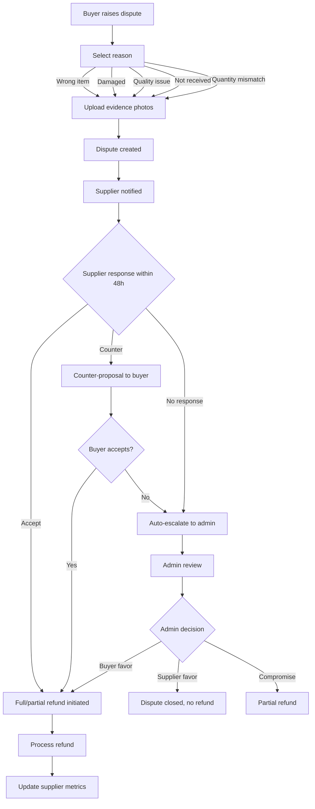

---

# PART B: PROCUREMENT WORKFLOWS

---

## 1. Requisition to PO Flow

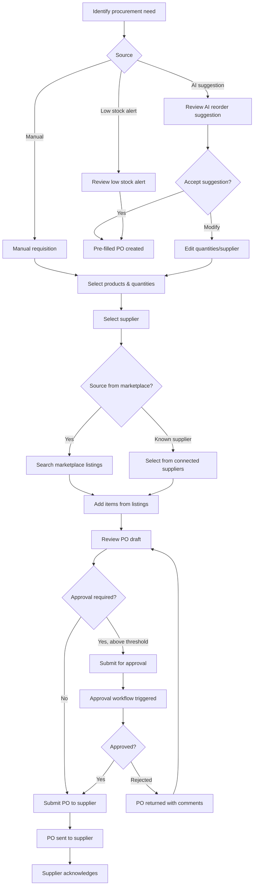

---

## 2. RFQ Flow

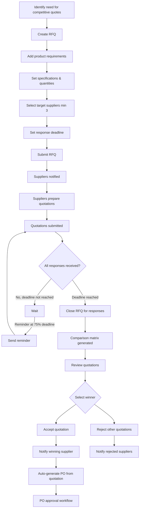

### Quotation Comparison Matrix

| Criteria | Supplier A | Supplier B | Supplier C |
|----------|-----------|-----------|-----------|
| Unit Price | ₹85 🟢 | ₹90 | ₹95 |
| Total Amount | ₹8,500 🟢 | ₹9,000 | ₹9,500 |
| Delivery Days | 3 | 2 🟢 | 5 |
| MOQ | 100 🟢 | 200 | 100 🟢 |
| Payment Terms | 30 days | 15 days | 45 days 🟢 |
| Rating | 4.2⭐ | 4.8⭐ 🟢 | 3.9⭐ |
| **Recommendation** | **Best Price** | **Best Overall** | — |

---

## 3. Multi-Level Approval Workflow

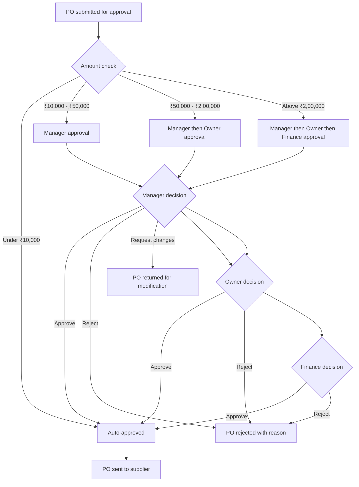

### Approval Configuration

```python
approval_rules = [
    {
        "name": "Auto-approve small orders",
        "condition": {"total_amount": {"lt": 10000}},
        "steps": []  # Auto-approved
    },
    {
        "name": "Manager approval",
        "condition": {"total_amount": {"gte": 10000, "lt": 50000}},
        "steps": [
            {"approver_type": "role", "role": "retail_manager", "auto_approve_hours": 48}
        ]
    },
    {
        "name": "Multi-level approval",
        "condition": {"total_amount": {"gte": 50000, "lt": 200000}},
        "steps": [
            {"approver_type": "role", "role": "retail_manager"},
            {"approver_type": "role", "role": "retail_owner"}
        ]
    },
    {
        "name": "Executive approval",
        "condition": {"total_amount": {"gte": 200000}},
        "steps": [
            {"approver_type": "role", "role": "retail_manager"},
            {"approver_type": "role", "role": "retail_owner"},
            {"approver_type": "specific_user", "user_id": "finance_head_id"}
        ]
    }
]
```

---

## 4. Goods Receipt Flow

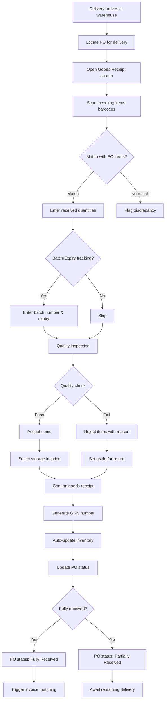

---

## 5. Three-Way Invoice Matching

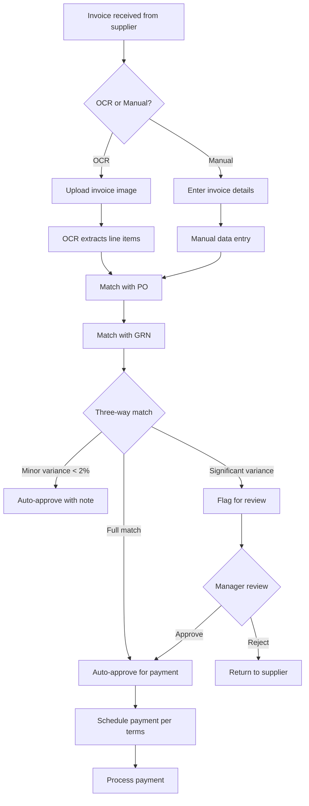

---

## 6. Auto-Reorder Flow

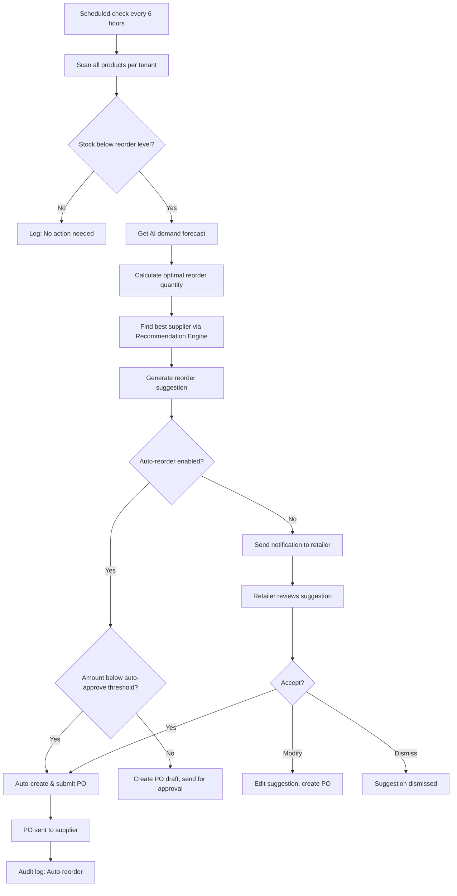

---

## 7. Supplier Return Flow

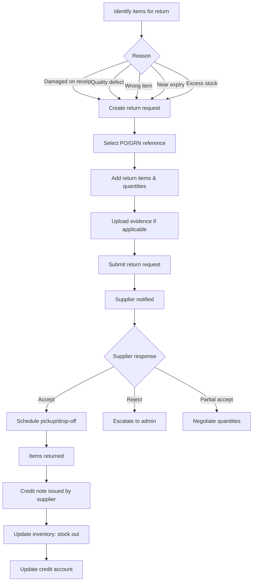
